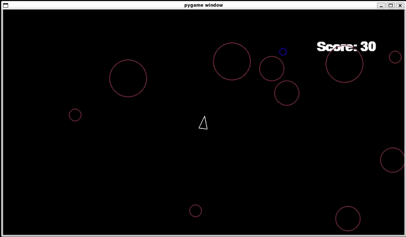

# Asteroids
Asteroids is a Python game built with Pygame in which the player controls a spaceship while navigating and destroying spawning asteroids. The project began as a guided Boot.dev assignment before being extended with inertia-based movement, scoring, custom audio feedback, and additional gameplay mechanics.

## Technical Highlights
- Object-oriented game architecture
- Event-driven game-loop management
- Frame-rate independent movement using delta time
- Sprite-group-based object management
- Stateful gameplay and scoring systems
- Collision detection between game objects

## Tech Stack
- Python
- Pygame

## Demo
### Gameplay Demonstration

Gameplay demonstration showcasing player movement, shooting, asteroid destruction, ore collection, scoring, and the game-over state.



## Quick Start
The following commands assume a Bash/WSL environment.
### Clone the Repository
```bash
git clone https://github.com/ajrollerson/asteroids.git
cd asteroids
```

### Create the Virtual Environment
```bash
python3 -m venv .venv
```

### Activate the Virtual Environment
```bash
source .venv/bin/activate
```

### Install Dependencies
```bash
pip install -r requirements.txt
```

### Start the Game
```bash
python3 main.py
```
### Play the game
#### Controls
- 'w' key - accelerate
- 's' key - decelerate
- 'a' key - turn left
- 'd' key - turn right
- 'space' key - shoot
#### Scoring and Buffs
- Destroy an asteroid - 10 points
- Purple ore - reduces shoot cooldown
- Red ore - increases fire rate
- Blue ore - +50 points
- Green ore - +100 points

### Deactivate the Virtual Environment
```bash
deactivate
```

Note: this project has been developed for Python 3.x using Pygame. It has been tested in Ubuntu on WSL and requires a virtual environment with Pygame installed. Running outside this environment may result in errors or missing functionality.

## Key Features
### Core Functionality
- Run a frame-rate independent game loop capped at 60 FPS
- Control the player using keyboard input
- Detect collisions between the player, shots, and asteroids
- Spawn and destroy game objects

### Independent Extensions
- Implemented inertia-based player movement using velocity
- Added scoring and an endgame state
- Created custom sound effects and score-dependent audio feedback
- Introduced ore objects providing score bonuses and player buffs
- Improved visual presentation through custom colours and aesthetics

## Design Choices
### Inertia-based Movement System
The original movement system was refactored to incorporate velocity, allowing the player to retain momentum briefly after directional input stops. This creates movement behaviour more appropriate to a spacecraft while requiring the game loop to update movement using frame-independent delta time.

### Scoring System
A scoring system was introduced to provide persistent feedback on player performance. The score is updated when asteroids are destroyed or ores are collected or shot, and is retained when the player enters the game-over state, allowing the final score to be displayed before the application exits.

### Custom Sound Effects
Custom voice recordings were created and modified using Audacity to provide audio feedback for gameplay events. Additional sounds were assigned to score thresholds, allowing the player's final performance to influence the audio feedback presented at the end of a game.

### Ore-Based Gameplay Mechanics
An ore system was introduced in which destroyed asteroids can spawn objects with different effects. Ores can modify player attributes such as shooting cooldown and projectile speed, or provide additional score when interacted with by the player or their shots, creating additional gameplay progression within each session.

## Known Limitations
- Rapidly firing or holding down the shoot key may cause some sound effects to stop playing permanently until the game is restarted. This appears to occur when multiple sound effects overlap through Pygame's audio mixer. Note: Playing single shots slowly will allow all sound effects to be heard correctly.

## Future Improvements
- Find a better way to implement sound effects, to avoid the aforementioned issue with overlapping sounds.
- Improve the UI to communicate ore effects and score thresholds
- Introduce an enemy spaceship with additional combat behaviour
